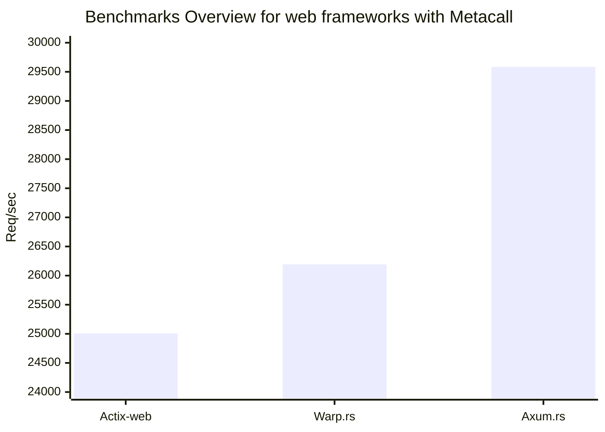
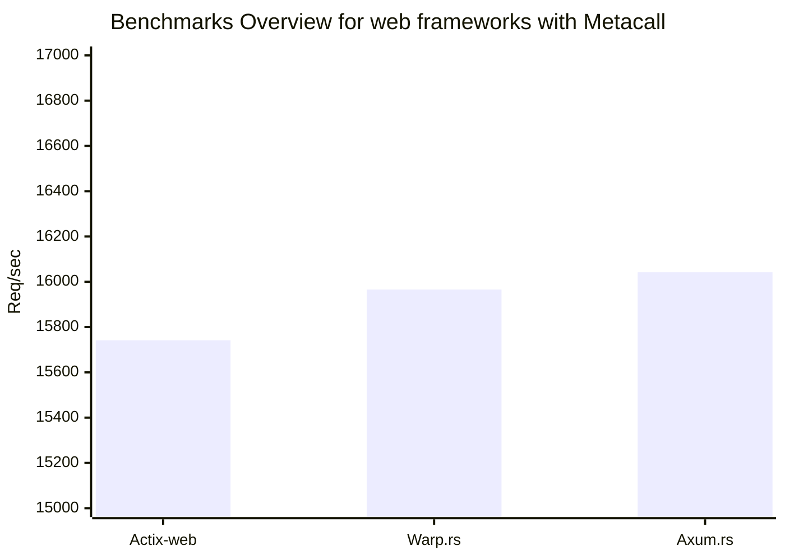
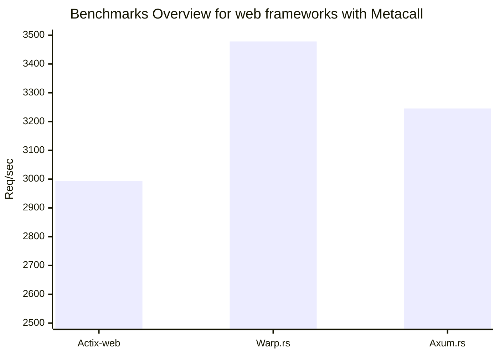

# Web frameworks benchmarking
## Specs

```
OS: Arch Linux x86_64 
Kernel: 6.6.16-1-lts 
CPU: 13th Gen Intel i5-13500H (16) @ 4.7GHz
metacall: v0.7.11
rustc: v1.76.0
```

## Results
> **Warning**  
>  results maybe not accurate, do benchmarks by yourself 


run this command
```terminal
$ ./benchmark.sh
```
### Hello world (Multi-threaded)


**Actix**
```
Running 15s test @ http://127.0.0.1:8080/hello/metacall
  12 threads and 1000 connections
  Thread Stats   Avg      Stdev     Max   +/- Stdev
    Latency    39.66ms    4.81ms 119.05ms   82.30%
    Req/Sec     2.10k   288.02     5.53k    63.52%
  376517 requests in 15.06s, 94.44MB read
Requests/sec:  25007.00
Transfer/sec:      6.27MB
```

**Warp**
```
Running 15s test @ http://127.0.0.1:8080/hello/metacall
  12 threads and 1000 connections
  Thread Stats   Avg      Stdev     Max   +/- Stdev
    Latency    38.76ms   25.39ms 304.64ms   76.17%
    Req/Sec     2.21k   443.59     4.49k    84.83%
  394726 requests in 15.07s, 99.00MB read
Requests/sec:  26192.36
Transfer/sec:      6.57MB
```
***Axum***
```
Running 15s test @ http://127.0.0.1:8080/hello/metacall
  12 threads and 1000 connections
  Thread Stats   Avg      Stdev     Max   +/- Stdev
    Latency    34.37ms   19.03ms 166.51ms   74.99%
    Req/Sec     2.49k   237.62     7.59k    92.12%
  446709 requests in 15.10s, 112.04MB read
Requests/sec:  29584.20
Transfer/sec:      7.42MB
```



### Generating 25th Fibonacci (Multi-threaded)


**Actix**
```
Running 15s test @ http://127.0.0.1:8080/fib/25
  12 threads and 1000 connections
  Thread Stats   Avg      Stdev     Max   +/- Stdev
    Latency    62.92ms   12.92ms 146.71ms   78.96%
    Req/Sec     1.32k   256.75     4.48k    77.05%
  237684 requests in 15.10s, 58.03MB read
Requests/sec:  15741.61
Transfer/sec:      3.84MB
```

**Warp**
```
Running 15s test @ http://127.0.0.1:8080/fib/25
  12 threads and 1000 connections
  Thread Stats   Avg      Stdev     Max   +/- Stdev
    Latency    62.66ms   39.89ms 514.13ms   72.28%
    Req/Sec     1.34k   283.51     3.11k    83.28%
  240039 requests in 15.03s, 58.60MB read
  Socket errors: connect 0, read 1, write 0, timeout 0
Requests/sec:  15965.78
Transfer/sec:      3.90MB
```
***Axum***
```
Running 15s test @ http://127.0.0.1:8080/fib/25
  12 threads and 1000 connections
  Thread Stats   Avg      Stdev     Max   +/- Stdev
    Latency    63.53ms   37.15ms 276.23ms   69.06%
    Req/Sec     1.35k   244.44     2.27k    79.48%
  241634 requests in 15.06s, 58.99MB read
Requests/sec:  16042.08
Transfer/sec:      3.92MB
```




### Generating 25th Fibonacci (Single-threaded)


**Actix**
```
Running 15s test @ http://127.0.0.1:8080/fib/25
  1 threads and 1 connections
  Thread Stats   Avg      Stdev     Max   +/- Stdev
    Latency   360.24us  394.85us  17.10ms   96.26%
    Req/Sec     3.01k   685.02     3.93k    71.33%
  44911 requests in 15.00s, 10.96MB read
Requests/sec:   2994.05
Transfer/sec:    748.51KB
```

**Warp**
```
Running 15s test @ http://127.0.0.1:8080/fib/25
  1 threads and 1 connections
  Thread Stats   Avg      Stdev     Max   +/- Stdev
    Latency   312.54us  382.83us  16.09ms   97.60%
    Req/Sec     3.50k   604.33     4.15k    85.33%
  52175 requests in 15.00s, 12.74MB read
Requests/sec:   3478.19
Transfer/sec:    869.55KB
```
***Axum***
```
Running 15s test @ http://127.0.0.1:8080/fib/25
  1 threads and 1 connections
  Thread Stats   Avg      Stdev     Max   +/- Stdev
    Latency   341.65us  511.46us  21.85ms   97.43%
    Req/Sec     3.26k   830.29     4.33k    72.00%
  48687 requests in 15.00s, 11.89MB read
Requests/sec:   3245.46
Transfer/sec:    811.37KB
```




