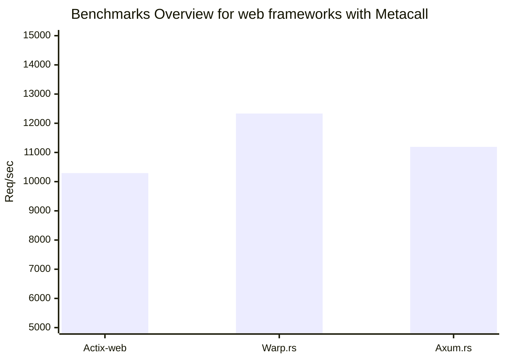

# Web frameworks benchmarking
## Specs

```
OS: Arch Linux x86_64 
Kernel: 6.6.16-1-lts 
CPU: 13th Gen Intel i5-13500H (16) @ 4.7GHz
metacall: v0.7.11
rustc: v1.76.0
```

## Results
> **Warning**  
>  results maybe not accurate, do benchmarks by yourself 

run this command
```terminal
$ ./benchmark.sh
```
**Actix**
```
Running 3s test @ http://127.0.0.1:8080
  1 threads and 1 connections
  Thread Stats   Avg      Stdev     Max   +/- Stdev
    Latency   195.37us  798.64us  16.64ms   97.65%
    Req/Sec    10.36k     2.97k   13.77k    74.19%
  31905 requests in 3.10s, 7.55MB read
Requests/sec:  10292.22
Transfer/sec:      2.43MB
```

**Warp**
```
Running 3s test @ http://127.0.0.1:8080
  1 threads and 1 connections
  Thread Stats   Avg      Stdev     Max   +/- Stdev
    Latency   217.28us    1.09ms  20.43ms   97.35%
    Req/Sec    12.39k     2.31k   14.52k    90.00%
  37004 requests in 3.00s, 8.75MB read
Requests/sec:  12333.89
Transfer/sec:      2.92MB
```
***Axum***
```
Running 3s test @ http://127.0.0.1:8080
  1 threads and 1 connections
  Thread Stats   Avg      Stdev     Max   +/- Stdev
    Latency   212.21us    0.98ms  18.70ms   97.47%
    Req/Sec    11.25k     2.84k   14.28k    77.42%
  34694 requests in 3.10s, 8.21MB read
Requests/sec:  11191.92
Transfer/sec:      2.65MB
```



