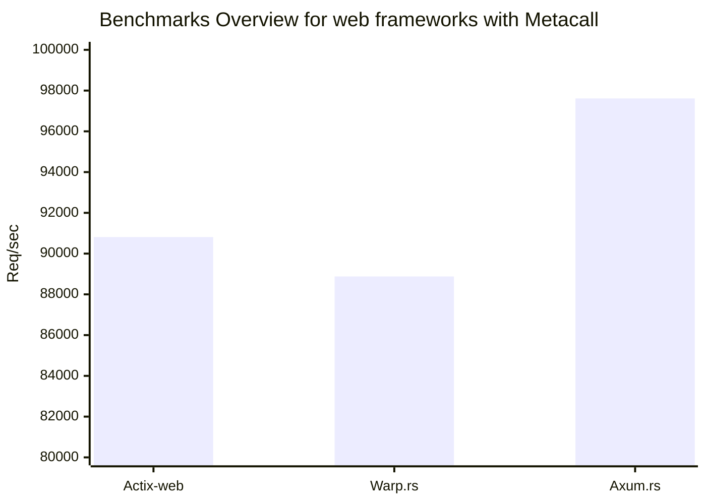
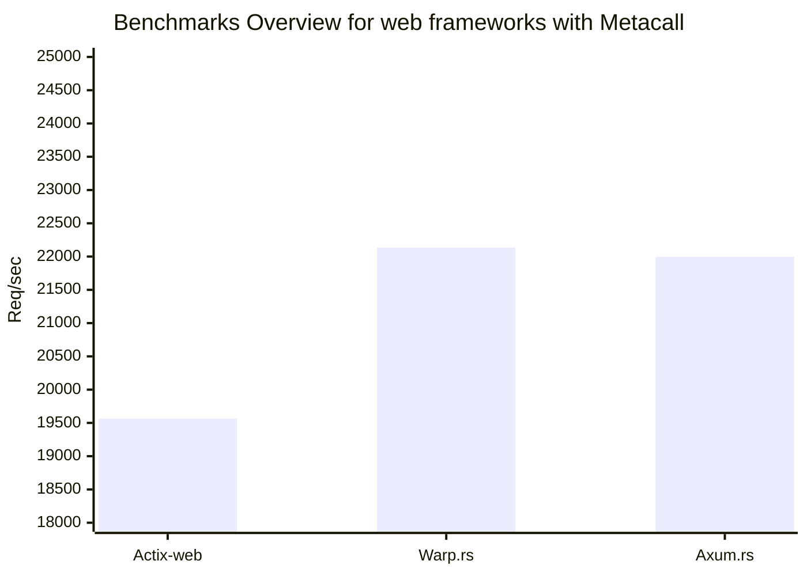
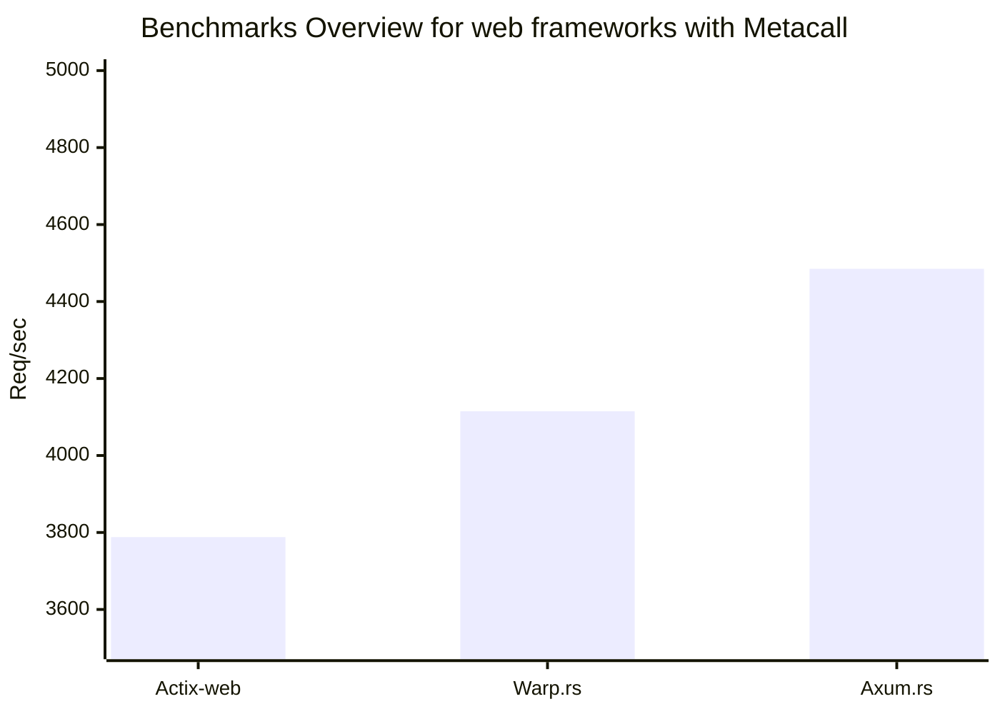

# Web frameworks benchmarking
## Specs

```
OS: Arch Linux x86_64 
Kernel: 6.6.16-1-lts 
CPU: 13th Gen Intel i5-13500H (16) @ 4.7GHz
metacall: v0.7.11
rustc: v1.76.0
```

## Results
> **Warning**  
>  results maybe not accurate, do benchmarks by yourself 


run this command
```terminal
$ ./benchmark.sh
```
### Hello world (Multi-threaded)


**Actix**
```
Running 15s test @ http://127.0.0.1:8080/hello/metacall
  12 threads and 1000 connections
  Thread Stats   Avg      Stdev     Max   +/- Stdev
    Latency    10.94ms    1.94ms  67.06ms   82.93%
    Req/Sec     7.63k     1.11k   27.37k    81.35%
  1372329 requests in 15.10s, 344.20MB read
Requests/sec:  90881.81
Transfer/sec:     22.79MB
```

**Warp**
```
Running 15s test @ http://127.0.0.1:8080/hello/metacall
  12 threads and 1000 connections
  Thread Stats   Avg      Stdev     Max   +/- Stdev
    Latency    11.46ms    9.56ms 233.40ms   86.77%
    Req/Sec     7.52k     2.13k   23.32k    86.84%
  1342041 requests in 15.10s, 336.61MB read
Requests/sec:  88877.69
Transfer/sec:     22.29MB
```
***Axum***
```
Running 15s test @ http://127.0.0.1:8080/hello/metacall
  12 threads and 1000 connections
  Thread Stats   Avg      Stdev     Max   +/- Stdev
    Latency    10.54ms    6.44ms  99.60ms   73.16%
    Req/Sec     8.20k     1.31k   18.07k    79.51%
  1473974 requests in 15.10s, 369.70MB read
Requests/sec:  97614.15
Transfer/sec:     24.48MB
```



### Generating 25th Fibonacci (Multi-threaded)


**Actix**
```
Running 15s test @ http://127.0.0.1:8080/fib/25
  12 threads and 1000 connections
  Thread Stats   Avg      Stdev     Max   +/- Stdev
    Latency    50.51ms    9.85ms  93.53ms   70.05%
    Req/Sec     1.65k   447.58    13.17k    85.64%
  295864 requests in 15.10s, 72.23MB read
Requests/sec:  19595.15
Transfer/sec:      4.78MB
```

**Warp**
```
Running 15s test @ http://127.0.0.1:8080/fib/25
  12 threads and 1000 connections
  Thread Stats   Avg      Stdev     Max   +/- Stdev
    Latency    45.26ms   28.70ms 237.71ms   73.14%
    Req/Sec     1.86k   487.02     6.54k    84.78%
  333713 requests in 15.06s, 81.47MB read
Requests/sec:  22153.99
Transfer/sec:      5.41MB
```
***Axum***
```
Running 15s test @ http://127.0.0.1:8080/fib/25
  12 threads and 1000 connections
  Thread Stats   Avg      Stdev     Max   +/- Stdev
    Latency    46.52ms   27.73ms 226.63ms   70.88%
    Req/Sec     1.85k   351.30     6.33k    84.13%
  331600 requests in 15.07s, 80.96MB read
Requests/sec:  21996.94
Transfer/sec:      5.37MB
```




### Generating 25th Fibonacci (Single-threaded)


**Actix**
```
Running 15s test @ http://127.0.0.1:8080/fib/25
  1 threads and 1 connections
  Thread Stats   Avg      Stdev     Max   +/- Stdev
    Latency   266.73us  127.35us   7.60ms   91.83%
    Req/Sec     3.81k   514.49     4.72k    64.67%
  56822 requests in 15.00s, 13.87MB read
Requests/sec:   3788.05
Transfer/sec:      0.92MB
```

**Warp**
```
Running 15s test @ http://127.0.0.1:8080/fib/25
  1 threads and 1 connections
  Thread Stats   Avg      Stdev     Max   +/- Stdev
    Latency   244.45us   82.65us   4.20ms   91.87%
    Req/Sec     4.13k   488.86     4.74k    74.83%
  62138 requests in 15.10s, 15.17MB read
Requests/sec:   4115.05
Transfer/sec:      1.00MB
```
***Axum***
```
Running 15s test @ http://127.0.0.1:8080/fib/25
  1 threads and 1 connections
  Thread Stats   Avg      Stdev     Max   +/- Stdev
    Latency   225.45us  114.41us   7.80ms   96.52%
    Req/Sec     4.51k   350.00     4.89k    86.09%
  67723 requests in 15.10s, 16.53MB read
Requests/sec:   4485.05
Transfer/sec:      1.09MB
```




